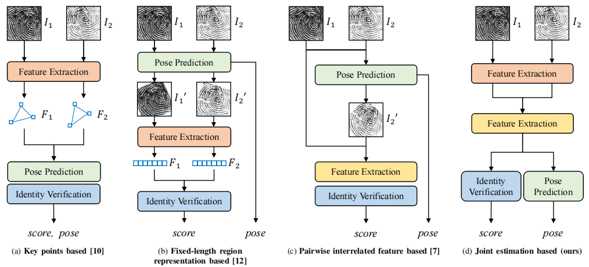
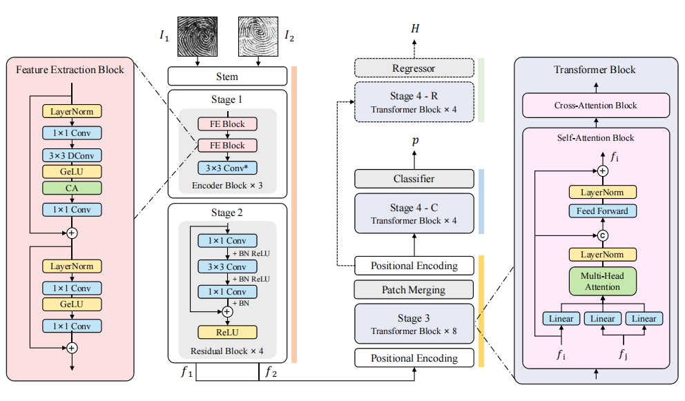

<!--
 * @Description: 
 * @Author: Xiongjun Guan
 * @Date: 2024-05-24 10:59:39
 * @version: 0.0.1
 * @LastEditors: Xiongjun Guan
 * @LastEditTime: 2026-04-16 12:01:48
 * 
 * Copyright (C) 2024 by Xiongjun Guan, Tsinghua University. All rights reserved.
-->

<p align="center" >
<a></a>
</p>

---

# Joint Identity Verification and Pose Alignment for Partial Fingerprints

<h5 align="left"> If our project helps you, please give us a star ⭐ on GitHub to support us. 🙏🙏 </h2>

<br>


  <a src="https://img.shields.io/badge/cs.CV-2405.03959-b31b1b?logo=arxiv&logoColor=red" href="https://arxiv.org/abs/2405.03959" height="25">   
</a> 


### 💬 This repo is the official implementation of:
- ***TIFS 2025***: [Joint Identity Verification and Pose Alignment for Partial Fingerprints](https://arxiv.org/abs/2405.03959) 

[Xiongjun Guan](https://xiongjunguan.github.io/), Zhiyu Pan, Jianjiang Feng, Jie Zhou

<br>

## Introduction
Currently, portable electronic devices are becoming more and more popular. For lightweight considerations, their fingerprint recognition modules usually use limited-size sensors. However, partial fingerprints have few matchable features, especially when there are differences in finger pressing posture or image quality, which makes partial fingerprint verification challenging. Most existing methods regard fingerprint position rectification and identity verification as independent tasks, ignoring the coupling relationship between them -- relative pose estimation typically relies on paired features as anchors, and authentication accuracy tends to improve with more precise pose alignment. In this paper, we propose a novel framework for joint identity verification and pose alignment of partial fingerprint pairs, aiming to leverage their inherent correlation to improve each other. To achieve this, we present a multi-task CNN (Convolutional Neural Network)-Transformer hybrid network, and design a pre-training task to enhance the feature extraction capability. Experiments on multiple public datasets (NIST SD14, FVC2002 DB1A & DB3A, FVC2004 DB1A & DB2A, FVC2006 DB1A) and an in-house dataset show that our method achieves state-of-the-art performance in both partial fingerprint verification and relative pose estimation, while being more efficient than previous methods.

The overall flowchart of our proposed algorithm is shown as follows.
<br>
<p align="center">
     <br />
</p>
<br>

The structure of **JIPNet** (the name `JIP` stands for **J**oint **I**dentity Verification and **P**ose Alignment for Partial Fingerprints) is shown as follows.
<br>
<p align="center">
     <br />
</p>
<br>

## Notice :exclamation:
The publicly available weights are only applicable to the testing scenarios in our paper. 

If you want to achieve better results, please retrain or fine tune in your local dataset.

<br>

## News :bell:
- **[Apr. 25 2025]** Train code is coming.
- **[Dec. 1 2024]** Inference model is available.
- **[Nov. 1 2024]** Code is coming.

<br>
  
## Requirements
```shell
einops==0.8.1
numpy==2.2.5
opencv_contrib_python==4.10.0.84
opencv_python==4.8.1.78
PyYAML==6.0.2
scipy==1.15.2
scikit-image>=0.19
timm==0.9.12
torch==2.1.2
tqdm==4.66.1
```

Install all dependencies:
```shell
pip install -r requirements.txt
```

<br>


## About the 5 Datasets in the Paper

The paper evaluates on **5 public datasets** (NIST SD14, FVC2002 DB1A/DB3A, FVC2004 DB1A/DB2A, FVC2006 DB1A). These are **test-only** — they are used only for `inference.py`, not for training.

Training was done on the authors' private "Hybrid DB". If you want to retrain, you need your own fingerprint data: images with FVC-style naming (`{FINGER_ID}_{IMPRESSION_ID}.png`) and multiple impressions per finger so genuine pairs can be generated.

<br>

## Dataset Structure

Each dataset used for training goes through its own pipeline and lives in its own sub-directory. The `build_manifest.py` script then merges their pair lists.

```
JIPNet/
├── data/                              # manifest files (built by build_manifest.py)
│   ├── train.npy
│   └── valid.npy
│
└── data_affine/
    ├── DatasetA/                      # e.g. your own DB, or FVC2002_DB1A
    │   ├── img/                       # aligned full-fingerprint images
    │   │   ├── 1_1.png                # naming: {FINGER_ID}_{IMPRESSION_ID}.png
    │   │   ├── 1_2.png
    │   │   └── ...
    │   ├── mask_erode/                # binary foreground masks (same naming)
    │   └── results/                   # output of generate_patch.py
    │       ├── img/                   # cropped patch pairs
    │       │   ├── 0_1.png
    │       │   ├── 0_2.png
    │       │   └── ...
    │       └── info/                  # pair metadata (.txt files)
    │           ├── 0.txt
    │           └── ...
    │
    ├── DatasetB/                      # a second dataset (optional)
    │   ├── img/
    │   ├── mask_erode/
    │   └── results/
    │       └── info/
    └── ...
```

> **Why separate sub-directories?** Each run of `generate_patch.py` starts its pair counter (`generate_idx`) from 0. Two datasets would produce files named `0_1.png`, `1_1.png`, ... that would collide if written to the same folder. Keeping them in separate `results/` directories avoids this. The `.txt` files store **absolute paths** so the training code finds the images correctly regardless of where they live.

Each `info/*.txt` file has 6 lines:

```
File for patch_info. from top to left: img_path1/2, info1/2, gt, ...
/abs/path/to/DatasetA/results/img/0_1.png
/abs/path/to/DatasetA/results/img/0_2.png
row1 col1 theta1          # centre position and rotation angle of patch 1
row2 col2 theta2          # centre position and rotation angle of patch 2
1                         # ground-truth label: 1=genuine pair, 0=impostor
```

<br>

## Train

### Step 1 — Generate training data

See the **Train Data Generation** section below. Run `generate_patch.py` **once per dataset**, pointing `--base_dir` to that dataset's folder:

```shell
# Dataset A
python make_data/generate_patch.py --base_dir ./data_affine/DatasetA

# Dataset B (optional second dataset)
python make_data/generate_patch.py --base_dir ./data_affine/DatasetB
```

Each run writes its output to `<base_dir>/results/img/` and `<base_dir>/results/info/` automatically.

### Step 2 — Build manifest files

After generating all datasets, run `build_manifest.py` to merge and split:

```shell
# Single dataset
python make_data/build_manifest.py \
    --info_dirs ./data_affine/DatasetA/results/info

# Two or more datasets — just list all info directories
python make_data/build_manifest.py \
    --info_dirs ./data_affine/DatasetA/results/info \
                ./data_affine/DatasetB/results/info
```

This collects all `.txt` pair files, shuffles, applies an 80/20 split, and writes `data/train.npy` + `data/valid.npy`. Missing datasets are automatically skipped with a warning — you do not need all datasets present.

Control the split ratio:
```shell
python make_data/build_manifest.py \
    --info_dirs ./data_affine/DatasetA/results/info \
    --train_ratio 0.9 \
    --seed 123
```

Then update `configs/JIPNet.yaml`:

```yaml
db_cfg:
  train_info_path: ./data/train.npy
  valid_info_path: ./data/valid.npy
```

### Step 3 — Configure training

Edit `configs/JIPNet.yaml` to match your setup:

```yaml
train_cfg:
  lr: 1.0e-3
  end_lr: 1.0e-6
  epochs: 16
  batch_size: 128       # total across all GPUs
  cuda_ids: [0]         # single GPU; use [0, 1] for 2-GPU training
  scheduler_type: CosineAnnealingLR
  optimizer: adamW
```

### Step 4 — Train

```shell
python train_JIPNet.py
```

Checkpoints and `info.log` are saved to `./saved/JIPNet/<save_title>/`.

:triangular_flag_on_post: The pretrained encoder is uploaded at `./JIPNet/encoder_bath.pth` in this [link](https://drive.google.com/drive/folders/1q9yopPjOFt9c9odCT1o4nheLvwrJaCu7?usp=sharing).

If you are interested in this part, you can refer to our other repository for training fingerprint enhancement networks.
https://github.com/XiongjunGuan/FpEnhancer

Note that the network of above repository‌ has been adjusted, and its weight cannot be directly applied to JIPNet.

<br>

## Multi-GPU Training (Kaggle / 2×T4)

The training script uses **DistributedDataParallel (DDP)** with `torch.multiprocessing.spawn`, so you only need to change one line in the config to enable multi-GPU:

```yaml
# configs/JIPNet.yaml
train_cfg:
  batch_size: 128       # total batch size — automatically divided by number of GPUs
  cuda_ids: [0, 1]      # list every GPU index you want to use
```

Then run the same command:

```shell
python train_JIPNet.py
```

The script will:
- Launch one process per GPU listed in `cuda_ids`
- Distribute `batch_size` evenly (64 per GPU for 2 GPUs)
- Use `DistributedSampler` so each GPU sees a non-overlapping slice of the dataset each epoch
- Only GPU 0 writes checkpoints and logs

**Kaggle notebook setup** — paste at the top of your notebook cell before training:

```python
import subprocess, sys

# Install dependencies
subprocess.run([sys.executable, "-m", "pip", "install", "-r", "requirements.txt", "-q"])

# Verify two GPUs are visible
import torch
print(f"GPUs available: {torch.cuda.device_count()}")   # expect 2 for 2×T4

# Set environment for DDP (already set by train_JIPNet.py, shown here for clarity)
import os
os.environ["MASTER_ADDR"] = "localhost"
os.environ["MASTER_PORT"] = "12355"
```

Then in the next cell:

```python
!python train_JIPNet.py
```

> **Note**: Kaggle provides 2×T4 (each 16 GB). With `batch_size: 128` and `cuda_ids: [0, 1]`, each GPU processes 64 samples — well within the 16 GB limit for `input_size: 160`.

:sparkles: At present, the training code has not been fully organized yet, and there may be some bugs that have not been discovered. Please feel free to discuss with me. :kissing_heart:

<br>

## Train Data Generation

:point_up: First, prepare your data following the `FVC` naming format:
`{FINGER_ID}_{IMPRESSION_ID}`

:point_up: Next, extract the required features, such as binary images and minutiae.
(This step is optional—they are mainly used for rigid registration and mask extraction. You may use alternative methods if preferred.)

:point_up: Finally, run the following commands:

```shell
cd ./make_data

# We use VeriFinger for rigid registration.
# This script will not run successfully due to licensing restrictions, and the source code cannot be released. It is provided for reference only.
python affine_pairs.py 

# Assuming you already have aligned data (genuine matches).
# Perfect alignment is not required; approximate alignment based on relative finger positions is sufficient.
python extract_mask.py 

# !! Each image must have at least one true match and one false match.
# Random cropping parameters can be adjusted in the code.
python generate_patch.py

```


<br>

## Test Data Preparation

The file structure in the example code is as follows:
```shell
root_path/examples/
├── data
|   ├── 0_1.png
|   ├── 0_2.png
|   ├── ......
├── result
|   ├── method
|   |   ├── 0.png
|   |   ├── 0.txt
|   |   ├── ......
```
Input paired images (`ftitle_1.png, ftitle_2.png`), output aligned results (`ftitle.png`) and classification probabilities/relative pose vectors (`ftitle.txt`).


The test data (part) is available from this [link](https://drive.google.com/drive/folders/17z14S86t9cs89rYL4_WkuJxek8Aaks1q?usp=sharing).

<br>

## Run
:star: The inference models are available from this [link](https://drive.google.com/drive/folders/1q9yopPjOFt9c9odCT1o4nheLvwrJaCu7?usp=sharing).

* **test JIPNet**
    ```shell
    python inference.py
    ```

<br>

:zap: The following models are reproduced by referring to corresponding papers. Some of them have been adjusted for partial fingerprint scenarios, so there may be some differences from the performance reported in original experiments.

* **test PFVNet**
    >Z. He, J. Zhang, L. Pang, and E. Liu, “PFVNet: A partial fingerprint verification network learned from large fingerprint matching,” IEEE Transactions on Information Forensics and Security, vol. 17, pp. 3706–3719, 2022.
    
    ```shell
    python inference_PFVNet.py
    ```

* **test AFRNet**
    >S. A. Grosz and A. K. Jain, “AFR-Net: Attention-driven fingerprint recognition network,” IEEE Transactions on Biometrics, Behavior, and Identity Science, vol. 6, no. 1, pp. 30–42, 2024.
    ```shell
    python inference_AFRNet.py
    ```

* **test DesNet**
    >S. Gu, J. Feng, J. Lu, and J. Zhou, “Latent fingerprint registration via matching densely sampled points,” IEEE Transactions on Information Forensics and Security, vol. 16, pp. 1231–1244, 2021.
    ```shell
    python inference_DesNet.py
    ```

* **test DeepPrint**
    >J. J. Engelsma, K. Cao, and A. K. Jain, “Learning a fixed-length fingerprint representation,” IEEE Transactions on Pattern Analysis and Machine Intelligence, vol. 43, no. 6, pp. 1981–1997, 2021.
    ```shell
    python inference_DeepPrint.py
    ```
    
* **test A-KAZE**
    >S. Mathur, A. Vjay, J. Shah, S. Das, and A. Malla, “Methodology for partial fingerprint enrollment and authentication on mobile devices,” in 2016 International Conference on Biometrics (ICB), 2016, pp. 1–8.
    ```shell
    python inference_AKAZE.py
    ```

<br>


## Citation
If you find this repository useful, please give us stars and use the following BibTeX entry for citation.
```
@ARTICLE{guan2024joint,
  author={Guan, Xiongjun and Pan, Zhiyu and Feng, Jianjiang and Zhou, Jie},
  journal={IEEE Transactions on Information Forensics and Security}, 
  title={Joint Identity Verification and Pose Alignment for Partial Fingerprints}, 
  year={2025},
  volume={20},
  number={},
  pages={249-263},
  keywords={Fingerprint recognition;Feature extraction;Pose estimation;Correlation;Fingers;Authentication;Transformers;Skin;Sensors;Prediction algorithms;Fingerprint recognition;partial fingerprint;fingerprint verification;fingerprint pose estimation;transformer},
  doi={10.1109/TIFS.2024.3516566}}
```

<br>

## License
This project is released under the MIT license. Please see the LICENSE file for more information.

<br>

## Contact me

If you have any questions about the code, please contact Xiongjun Guan gxj21@mails.tsinghua.edu.cn
